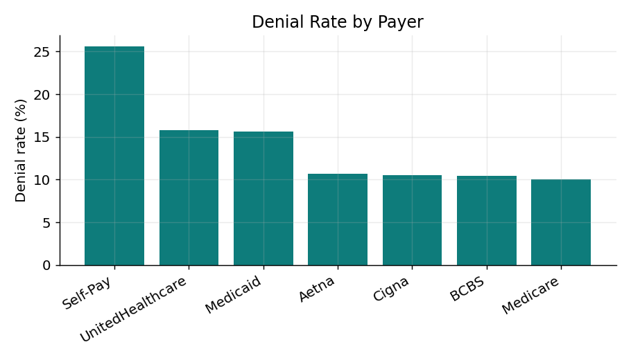
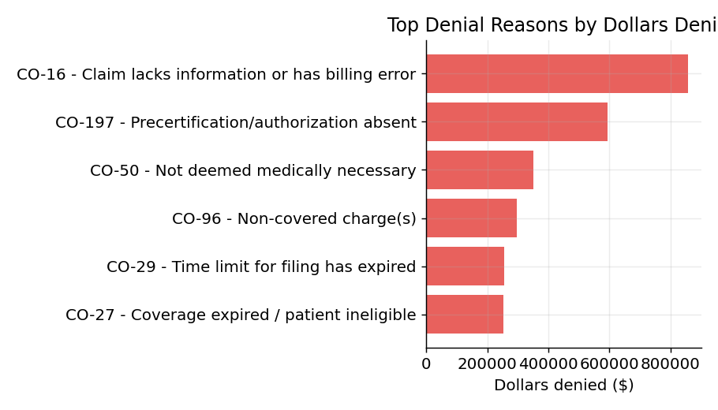
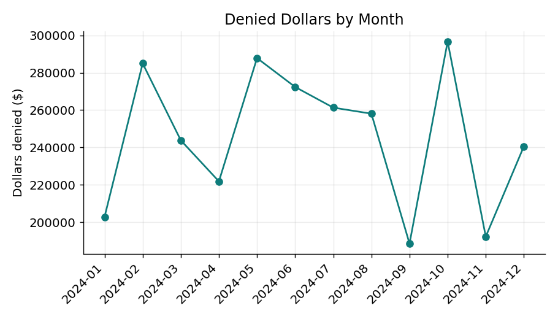

# Hospital Revenue Cycle: Claim Denials Analysis

**Analyzing $2.95M in denied hospital claims to find where the money is recoverable — and why claims are being denied in the first place.**

A SQL + Python analysis of 6,000 hospital claims that identifies the payers, denial reasons, and service lines driving lost revenue, and quantifies how much of it is winnable back through appeals and front-end fixes.

---

## The business problem

Every denied claim is delayed or lost revenue. A hospital's revenue cycle team needs to answer three questions fast:
1. How bad is our denial problem, in dollars?
2. *Why* are claims being denied — and are those reasons preventable?
3. Where should we focus limited staff time to recover the most money?

This project answers all three from raw claims data.

## Key findings

- **12.7% of claims were denied**, representing **$2.95M in denied charges** across 763 claims.
- **76% of denied dollars ($2.23M) are *recoverable*** — tied to fixable, appealable reasons rather than hard write-offs. This is the headline opportunity: most of the lost revenue is winnable.
- **The top two denial reasons are both front-end, preventable problems:** missing information / billing errors (CO-16, $858K) and absent prior authorization (CO-197, $595K). Together they account for roughly half of all denied dollars.
- **Self-Pay (25.6%), UnitedHealthcare (15.8%), and Medicaid (15.6%)** have the highest denial rates — the clearest targets for payer-specific outreach and eligibility checks.
- **Orthopedics, Radiology, and Surgery** carry the highest service-line denial rates, pointing to where authorization workflows need tightening.

**Recommendation:** prioritize (1) an appeals push on the $2.23M recoverable bucket and (2) front-end fixes — registration data quality and prior-auth verification — which would prevent the single largest category of denials before claims ever go out.

## Visualizations







---

## Tools & skills demonstrated

| Skill | How it's used here |
|-------|--------------------|
| **SQL** | Aggregation, `GROUP BY`, `CASE WHEN`, filtering, and date handling to answer each business question (`sql/analysis.sql`) |
| **Python (pandas)** | Loading, cleaning, and orchestrating the analysis |
| **SQLite** | Running real SQL queries against the data from Python |
| **matplotlib** | Building clean, presentation-ready charts |
| **Healthcare domain** | Real CARC denial codes, payer mix, recoverable-vs-hard denial logic, revenue cycle KPIs |

## How to run it

```bash
pip install -r requirements.txt
python data/generate_data.py   # creates data/claims.csv
python analysis.py             # runs the SQL, prints findings, saves charts
```

## About the data

The dataset (`data/claims.csv`, 6,000 claims) is **simulated** — it contains no real patient information — but it is modeled on the true structure of hospital claims and uses **real CARC (Claim Adjustment Reason Codes)** so the analysis mirrors what a working revenue cycle analyst sees. The generator (`data/generate_data.py`) is fully reproducible via a fixed random seed.

*To run this on real data:* swap in a claims extract with the same columns (`payer`, `service_line`, `billed_amount`, `claim_status`, `denial_code`, etc.) and the SQL runs unchanged.

## Repository structure

```
revenue-cycle-denials/
├── README.md
├── requirements.txt
├── analysis.py              # main analysis + charts
├── data/
│   ├── generate_data.py     # reproducible data generator
│   └── claims.csv           # the dataset
├── sql/
│   └── analysis.sql         # all queries, commented
└── charts/                  # generated visualizations
```
